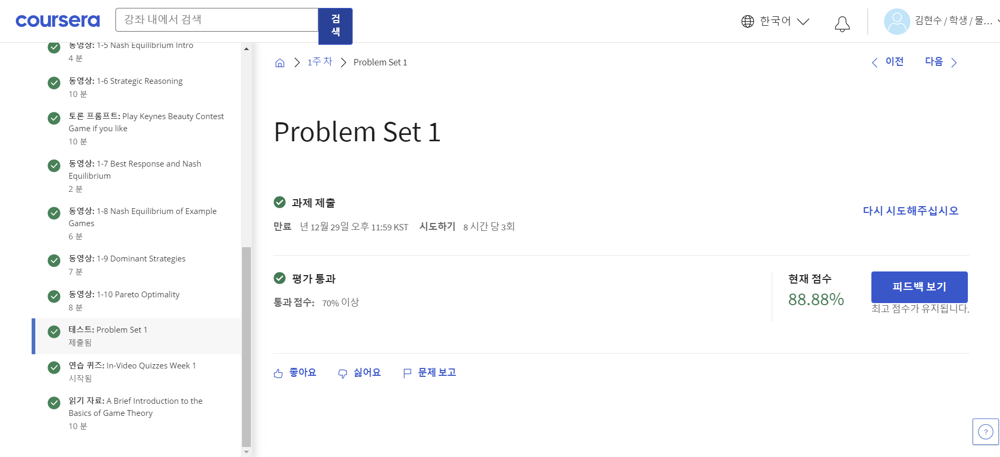

**Week 1**

[Contents]

1-1 Game Theory Intro - TCP Backoff

1-2 Self-Interested Agents and Utility Theory

1-3 Defining Games

1-4 Examples of Games

1-5 Nash Equilibrium Intro

1-6 Strategic Reasoning

1-7 Best Response and Nash Equilibrium

1-8 Nash Equilibrium of Example Games

1-9 Dominant Strategies

1-10 Pareto Optimality

Problem Set 1

•학점: 88.88%

