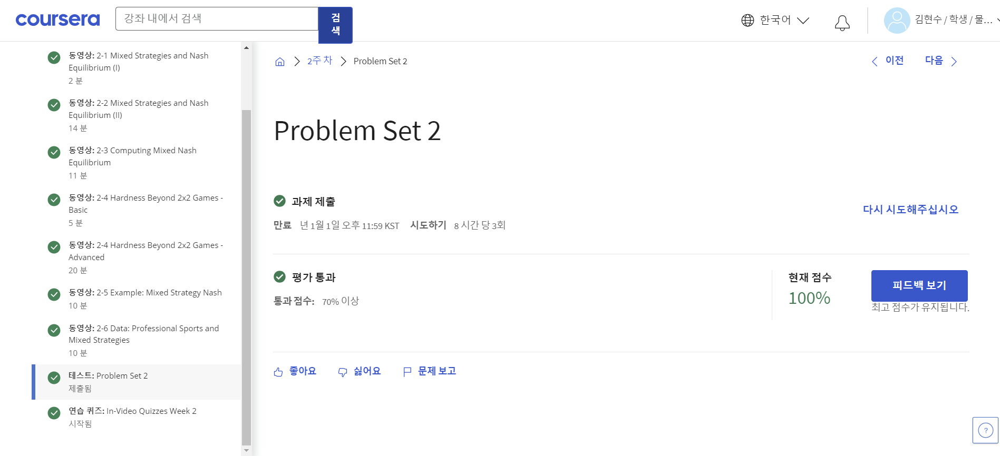

**Week 2**

[Contents]

2-1 Mixed Strategies and Nash Equilibrium (I)

2-2 Mixed Strategies and Nash Equilibrium (II)

2-3 Computing Mixed Nash Equilibrium

2-4 Hardness Beyond 2x2 Games - Basic

2-4 Hardness Beyond 2x2 Games - Advanced

2-5 Example: Mixed Strategy Nash

2-6 Data: Professional Sports and Mixed Strategies

Problem Set 2

•학점: 100%

