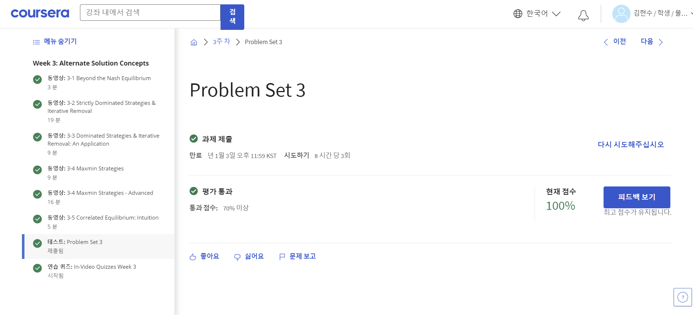

**Week 3**

[Contents]

3-1 Beyond the Nash Equilibrium

3-2 Strictly Dominated Strategies & Iterative Removal

3-3 Dominated Strategies & Iterative Removal: An Application

3-4 Maxmin Strategies

3-4 Maxmin Strategies - Advanced

3-5 Correlated Equilibrium: Intuition

Problem Set 3

•학점: 100%

